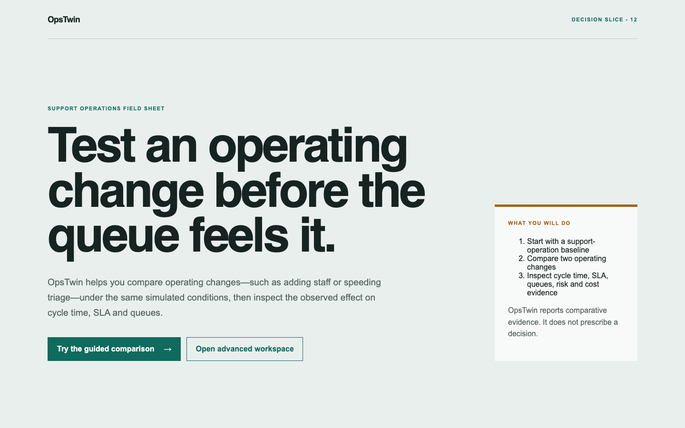
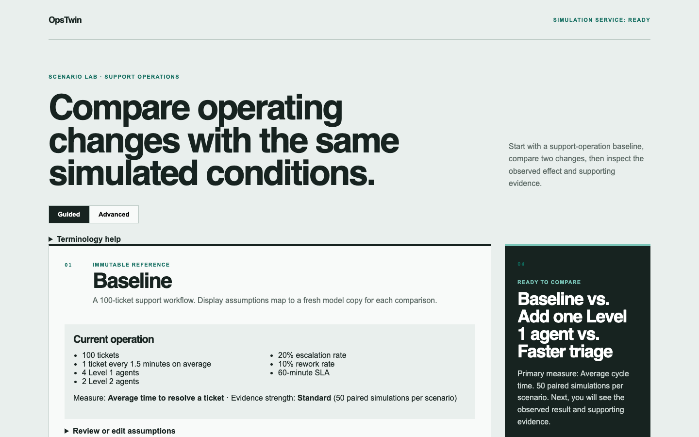
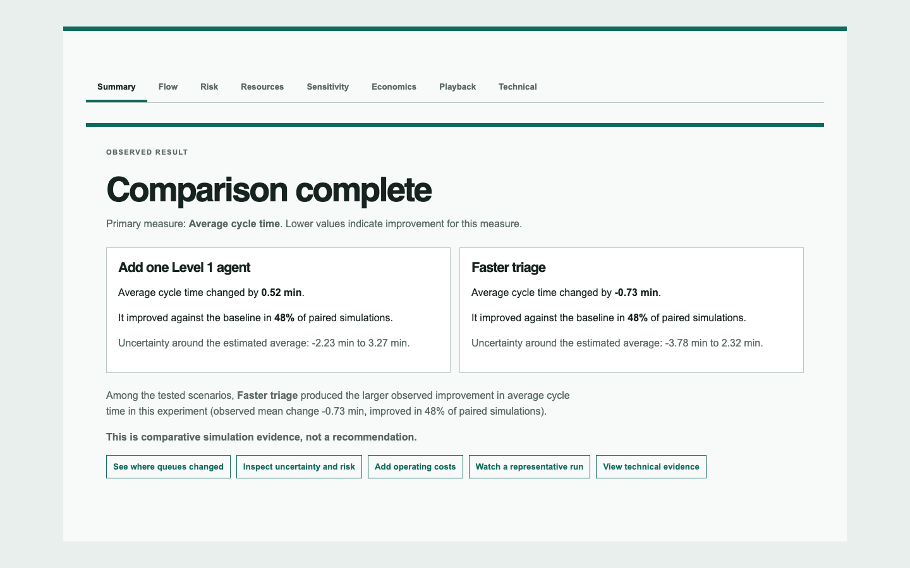
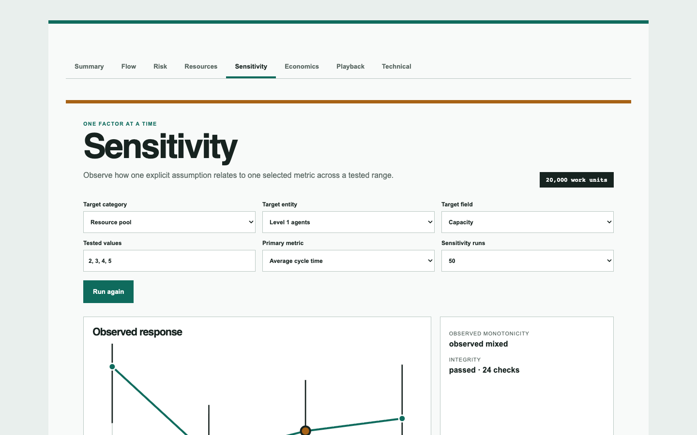
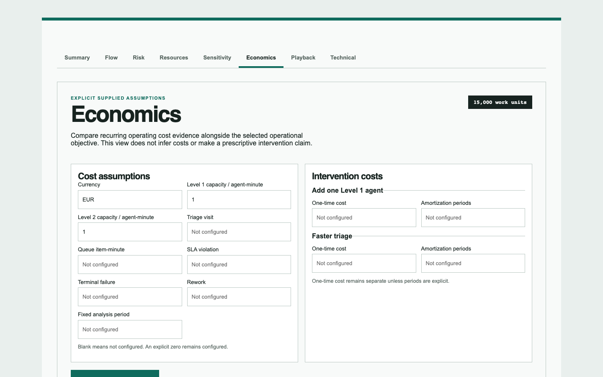
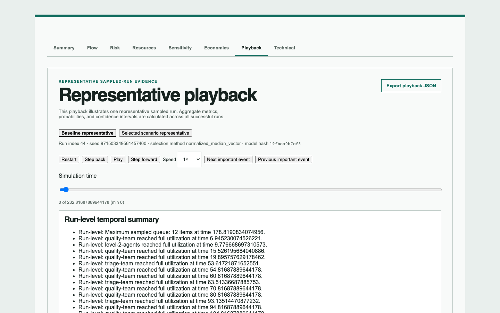
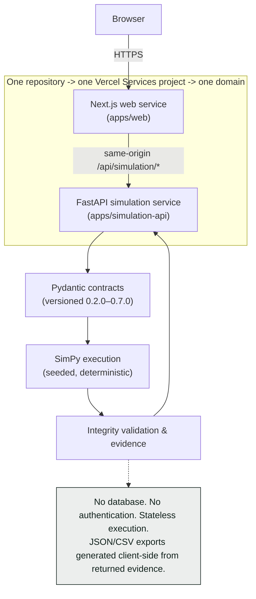
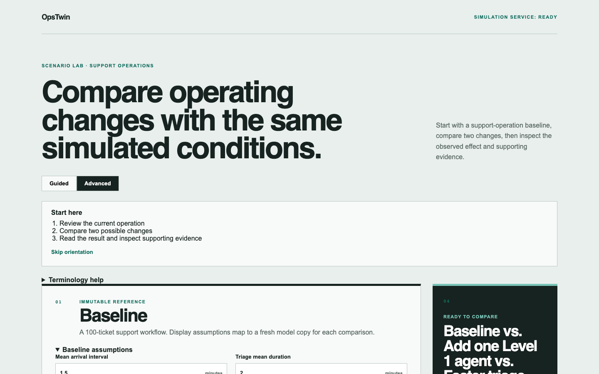

# OpsTwin

Operational simulation and decision lab for testing service-workflow
changes before implementing them.

**[Live demo](https://ops-twin.vercel.app)** ·
**[Guided workspace](https://ops-twin.vercel.app/workspace)** ·
**[Advanced workspace](https://ops-twin.vercel.app/workspace?mode=advanced)** ·
**[Architecture](docs/ARCHITECTURE.md)** ·
**[Run locally](#run-locally)**



## At a glance

| Field | Value |
| --- | --- |
| Product | Operational simulation and decision-support application |
| Domain | Support and service operations |
| Role | Product design, architecture, implementation and verification |
| Status | Core product complete and deployed |
| Frontend | Next.js, React, TypeScript |
| Simulation | FastAPI, Python, SimPy |
| Deployment | One Vercel Services project |
| Live | `https://ops-twin.vercel.app` |

> The project was built through AI-assisted software development, while
> product scope, architecture, acceptance criteria, verification and final
> decisions remained human-directed.

No software license has been granted yet. Source visibility does not
automatically grant permission to copy, modify, or redistribute this work.
Repository visibility and software licensing are separate decisions — see
[Security, contributions and license](#security-contributions-and-license).

## The problem

Most operational dashboards describe the past: last week's average handle
time, last month's SLA attainment. They don't tell you what happens if you
change something. Add a Level 1 agent, or speed up triage, or raise the
escalation threshold, and the effect ripples through queues, resource
contention, and downstream stages in ways that are hard to reason about
from a spreadsheet — staffing, process speed, and rework all interact.

A decision-maker weighing two candidate changes usually has to guess, pilot
one in production and hope, or build a bespoke model from scratch. OpsTwin's
premise is that a bounded, honest simulation can give comparative evidence
before either of those. The canonical question it's built to answer:

> What changes if we add one Level 1 agent instead of reducing triage time
> by 25%?

That framing — comparative evidence for a specific decision, not a general
forecasting tool — drives every modeling and product choice below.

## The solution

OpsTwin takes an operational baseline (a support workflow with explicit
staffing, arrival rate, processing times, escalation and rework
probabilities, and an SLA target), lets you define one or more intervention
scenarios as bounded overrides of that baseline, and runs paired repeated
simulations — the baseline and every scenario share the same sequence of
random seeds, run for run, so differences are attributable to the change,
not to random noise. The comparison surfaces a factual result: which
scenario showed the larger observed improvement, by how much, how often it
improved, and how much uncertainty surrounds that estimate.

Two ways to use it:

- **Guided mode** (default) walks through baseline → two candidate changes
  → one run → a plain-language result, with deeper evidence one panel at a
  time.
- **Advanced mode** exposes the full editable workspace: up to three
  scenarios, execution settings, guardrails, and every evidence tab at
  once.



## Product walkthrough

1. Review the current operation — a 100-ticket support workflow with
   explicit staffing, timing, and SLA assumptions.
2. Compare two changes — e.g. adding a Level 1 agent vs. speeding up
   triage.
3. Run 50 paired simulations per scenario, sharing the baseline's random
   seed schedule.
4. Read the factual result: observed change, improvement probability, and
   an uncertainty range, in plain language.
5. Inspect Flow, Risk, Resources, Sensitivity, Economics, or Playback for
   deeper evidence, one panel at a time.
6. Export the comparison and evidence as JSON or CSV.



## Why paired simulation

The comparison isn't "run the baseline once, run the scenario once, and
diff them." Every baseline/scenario pair uses matching simulated conditions
— the same random-number schedule drives run 1 of the baseline and run 1
of every scenario, run 2 drives run 2, and so on (common random numbers).
Differences are evaluated within matched runs, not across independent
samples. Repetition (50 paired runs by default) exposes how much the
observed difference varies. A few things that follow from this design,
stated plainly because they're easy to misread:

- **Improvement probability is not certainty.** "Improved in 48% of paired
  simulations" describes the share of matched runs where the scenario beat
  the baseline — not a 48% chance of success in production.
- **Confidence intervals describe estimation uncertainty**, not a
  guaranteed range of real-world outcomes.
- **Ranking is comparative, not prescriptive.** OpsTwin reports which
  tested scenario showed the larger observed improvement; it does not
  recommend an action.

See [`docs/SCENARIO_COMPARISON_SPEC.md`](docs/SCENARIO_COMPARISON_SPEC.md)
for the full contract, including guardrails, eligibility, and the exact
ranking order.

## Key capabilities

### Scenario comparison

Paired execution of a baseline against up to three explicit scenarios,
producing paired deltas, confidence intervals, an improvement probability,
risk classification, and a comparative ranking. It does not claim causal
proof, an optimum, or an operational recommendation.

### Workflow and resource evidence

A deterministic, read-only "Flow" map traces the operational structure —
stages, routes, and resource pools — and overlays explicit scenario
changes and backend-returned pressure evidence (queueing, utilization) when
a result exists. It never becomes a simulation input; it's presentation
only, paired with an accessible list equivalent.

### Sensitivity

One explicit factor (e.g. Level 1 agent capacity) swept across explicit
tested values (e.g. 2, 3, 4, 5), under the same paired-seed discipline as
the main comparison. No interpolation, no extrapolation, no
multi-factor interaction, no optimization — see
[`docs/SENSITIVITY_ANALYSIS_SPEC.md`](docs/SENSITIVITY_ANALYSIS_SPEC.md).



### Economics

Recurring and one-time cost evidence, paired to the same comparison runs,
using **only assumptions you explicitly supply** — currency, per-minute
resource costs, SLA violation costs, and so on. A blank field means
"unconfigured," never zero; the screenshot below shows exactly that state.



### Representative playback

A deterministic, client-side reconstruction of the timeline for **one**
sampled representative run per side of the comparison — queueing,
resource use, rework, completion — without presenting that one run as
aggregate certainty. Aggregate metrics, probabilities, and confidence
intervals are still computed across all successful runs; playback
illustrates one of them.



### Integrity validation

Every simulation response passes automatic contract, deterministic, and
mathematical invariant checks before it reaches the UI — malformed or
inconsistent evidence fails safely with a structured error rather than
silently rendering.

## Usability iteration

The honest version of this story includes a stretch where the product was
technically complete but hard to use for someone seeing it cold.

**Before (Sprint 12 audit, simulated/expert review — no human participants
yet):** the landing copy led with paired-simulation mechanics before the
decision itself; baseline, scenario, and seed fields all appeared before
the primary action; results rendered after Flow, Sensitivity, Economics,
and Playback, with statistical terms more prominent than plain language;
the Flow view had no result-first cue; the playback disclaimer was
accurate but hard to reach.

**Changes (Sprints 12 and 12.1):** Guided mode became the default,
no-edit, decision-first flow. Results now render immediately after the run
action, with response-direction-aware language ("Faster triage produced
the larger observed improvement..."). A first-run orientation and an
accessible terminology glossary were added. Evidence moved to a single
accessible tablist — one panel visible at a time (Summary, Flow, Risk,
Resources, Sensitivity, Economics, Playback, Technical) — instead of one
long scrolling page. Advanced mode still exposes the full original editing
surface at `/workspace?mode=advanced`.

**Evidence:** the frontend test suite grew from 142 to 172 tests across
these two sprints, with no test deleted; a full production browser
walkthrough at three viewports found zero console errors and zero
hydration warnings; automated regression, expert/heuristic review, and an
owner walkthrough all passed.

**Limitation, stated plainly:** a five-participant human usability study
has not been completed. Everything above is automated regression, expert
review, and owner/browser QA — real evidence, but not a substitute for
watching an unfamiliar person use the product. See
[`docs/USABILITY_TEST_PLAN.md`](docs/USABILITY_TEST_PLAN.md) and
[`docs/USABILITY_FINDINGS.md`](docs/USABILITY_FINDINGS.md).

## Architecture



The web app (Next.js/React/TypeScript) renders the Guided and Advanced
interfaces and calls the simulation API through a same-origin rewrite —
there is no separate public API host. The FastAPI service validates
requests against versioned Pydantic/JSON Schema contracts, runs a seeded
SimPy discrete-event simulation, and returns audited, integrity-checked
evidence. Both services deploy from **one repository** into **one Vercel
Services project** behind **one domain**. There is no database, no
authentication, and no persistence; every request is stateless. See
[`docs/ARCHITECTURE.md`](docs/ARCHITECTURE.md) for the full breakdown.

## Important engineering decisions

- **SimPy**, not a hand-rolled queue approximation, drives execution — see
  [ADR-002](docs/adrs/ADR-002-python-simulation-service.md).
- **Versioned contracts** (`0.2.0` through `0.7.0`) mean a scenario,
  sensitivity, or economics change is additive and explicit, never a
  silent shape change.
- **Deterministic child-seed derivation**: repeated-run seeds derive from
  SHA-256 of `<baseSeed>:<runIndex>` — see
  [ADR-009](docs/adrs/ADR-009-deterministic-repeated-run-seed-schedule.md).
- **Common random numbers** pair baseline and scenario runs on the same
  seed schedule — see
  [ADR-012](docs/adrs/ADR-012-paired-common-random-numbers.md).
- **Online statistical aggregation** avoids retaining full per-run event
  logs for ordinary runs — see
  [ADR-010](docs/adrs/ADR-010-online-aggregation-and-representative-rerun.md).
- **Identity-based scenario overrides**, not free-form model editing — see
  [ADR-011](docs/adrs/ADR-011-identity-based-scenario-overrides.md).
- **Explicit economics**: no inferred costs, no implicit zero — see
  [ADR-019](docs/adrs/ADR-019-explicit-economic-assumptions.md).
- **Representative evidence has a stated boundary**: one sampled run is
  never presented as aggregate truth — see
  [ADR-021](docs/adrs/ADR-021-playback-as-representative-evidence.md).
- **The web service owns its own runtime assets** rather than reaching
  outside its deployed boundary — see the deployment incident below and
  [ADR-014](docs/adrs/ADR-014-vercel-services-deployment-model.md).
- **Guided mode is presentation, not a second analytical path** — it
  reuses the same backend evidence and ranking as Advanced mode.

## Deployment incident

Production first failed at `next build` (commit `fd1c3f4`) with `Module
not found: Can't resolve '../../../../examples/product/support-operations-baseline.json'`.
`apps/web/lib/templates/support.ts` imported a baseline fixture from
`examples/`, and `.vercelignore` excludes `examples/` from the deployed
bundle — so once Vercel stripped that directory, Turbopack couldn't
resolve the import. It was never a Vercel infrastructure problem; it was a
packaging boundary problem. The fix packaged a runtime copy of that JSON
file inside `apps/web/lib/templates/` (the web service's own directory)
and added `pnpm verify:vercel-runtime`, a regression script that fails the
build if the runtime copy ever diverges from the canonical example again.
That check now runs as part of `pnpm build:vercel` and `pnpm verify`.

The lesson generalizes: **deployment boundaries are architectural
boundaries.** A file that looks like a normal same-repo import can still
be unreachable in production if it crosses an ignore boundary. Fixing the
symptom wasn't enough — the fix needed a regression check, because the
same class of mistake was otherwise free to reappear.

## Verification evidence

| Gate | Current evidence |
| --- | ---: |
| Backend tests | 247 passed |
| Frontend tests | 172 passed (22 test files) |
| ESLint | Passed (51 source files) |
| TypeScript | Passed |
| Ruff | Passed |
| Mypy strict | Passed (51 source files) |
| Next.js build | Passed |
| FastAPI build | Passed |
| Source package | Passed (336 files, clean-clone bootstrap/lint/typecheck/test/build all passed) |
| Production deployment | Ready |
| Guided/Advanced SSR routing | Verified |
| Production runtime errors | State observation window |

Every number above is filled in from a command actually executed during
this sprint, not carried over from an earlier one — see
[`docs/PUBLIC_CLAIM_REGISTER.md`](docs/PUBLIC_CLAIM_REGISTER.md) for the
full evidence mapping and
[`docs/sprints/SPRINT_13_PUBLIC_PORTFOLIO_RELEASE.md`](docs/sprints/SPRINT_13_PUBLIC_PORTFOLIO_RELEASE.md)
for the exact commands run. "Production runtime errors" reports a bounded
observation window from manual QA, not a continuous-uptime guarantee.

## Performance evidence

> These are local or single-deployment measurements, not load-test or
> capacity guarantees.

Bounded benchmarks exist for the simulation kernel, repeated execution,
scenario comparison, sensitivity, economics, and playback reconstruction at
several workload sizes. See
[`docs/PERFORMANCE_BASELINE.md`](docs/PERFORMANCE_BASELINE.md),
[`docs/REPEATED_RUN_PERFORMANCE.md`](docs/REPEATED_RUN_PERFORMANCE.md),
[`docs/SCENARIO_COMPARISON_PERFORMANCE.md`](docs/SCENARIO_COMPARISON_PERFORMANCE.md),
[`docs/SENSITIVITY_PERFORMANCE.md`](docs/SENSITIVITY_PERFORMANCE.md),
[`docs/ECONOMIC_PERFORMANCE.md`](docs/ECONOMIC_PERFORMANCE.md), and
[`docs/PLAYBACK_PERFORMANCE.md`](docs/PLAYBACK_PERFORMANCE.md). Production
route timings in
[`docs/VERCEL_PREVIEW_EVIDENCE.md`](docs/VERCEL_PREVIEW_EVIDENCE.md) are
single-request measurements against one live deployment.

## Technical stack

| Layer | Technology | Responsibility |
| --- | --- | --- |
| Web | Next.js, React, TypeScript | Guided and Advanced interfaces |
| API | FastAPI, Pydantic | Contracts and orchestration |
| Simulation | SimPy, Python | Discrete-event execution |
| Validation | Pytest, Vitest, mypy, ESLint | Regression and integrity |
| Deployment | Vercel Services | One-domain web/API hosting |

## Run locally

Prerequisites: Git, Node.js (22.13+ for `pnpm` via Corepack — see a note
below if your default Node is older), pnpm, and Python 3.12.

```sh
pnpm bootstrap
pnpm dev
pnpm verify
```

`pnpm dev` starts both services and prints the Web
(`http://localhost:3000`), API (`http://localhost:8000`), and health URLs.
`pnpm verify` is the full local gate (lint, typecheck, tests, both builds,
the canonical example, benchmark smokes, and source packaging). See the
[Quality gates](#quality-gates-reference) section below for the individual
commands, and
[`docs/VALIDATION_PLAN.md`](docs/VALIDATION_PLAN.md) for what each gate
actually proves.

### Quality gates reference

```sh
pnpm lint
pnpm typecheck
pnpm test
pnpm test:web
pnpm build
pnpm verify
pnpm package:source
pnpm verify:source-package
```

## API surface

| Endpoint | Purpose |
| --- | --- |
| `GET /api/simulation/health` | Service readiness |
| `POST /api/simulation/simulate` | Single seeded run (`0.3.0`) |
| `POST /api/simulation/simulate/repeated` | Repeated runs with aggregation (`0.4.0`) |
| `POST /api/simulation/compare/scenarios` | Paired scenario comparison (`0.5.0`) |
| `POST /api/simulation/analyze/sensitivity` | One-factor-at-a-time sensitivity (`0.6.0`) |
| `POST /api/simulation/analyze/economics` | Explicit-assumption economics (`0.7.0`) |
| `POST /api/simulation/analyze/economic-sensitivity` | Economic sensitivity sweep (`0.7.0`) |

Full request/response schemas live in `contracts/`; worked examples live in
`examples/`.

## Repository structure

```text
apps/web              Next.js interface (Guided + Advanced Scenario Lab)
apps/simulation-api    FastAPI service, Pydantic models, SimPy engine, CLI
contracts              Versioned JSON Schema boundaries
examples               Deterministic and stochastic worked examples
docs                    Specs, ADRs, sprint records, validation plan
scripts                 Bootstrap, dev, build, and verification tooling
```

## Limitations and non-goals

- The canonical model covers a support-operations workflow — it is not an
  arbitrary workflow builder.
- No database, authentication, persistence, or user accounts.
- No real-user or real-company data has been processed.
- No autonomous recommendation and no optimization guarantee — OpsTwin
  reports comparative evidence, not decisions.
- No causal claim — results are simulation evidence, not proof.
- No load-test guarantee — performance evidence is bounded and local or
  single-deployment.
- Representative playback shows one sampled run, not aggregate truth.
- A five-participant human usability study has not yet been run.

## What I learned

- Analytical correctness does not guarantee usability — a mathematically
  sound tool can still be unusable to someone seeing it for the first
  time.
- Simulation outputs need explicit interpretation boundaries, or people
  will read more certainty into them than the math supports.
- A missing assumption must stay missing — silently defaulting it to zero
  or "typical" is worse than showing "not configured."
- Paired evidence (common random numbers) is a meaningfully stronger claim
  than comparing two unrelated simulation runs.
- Representative evidence and aggregate evidence answer different
  questions; conflating them in the UI would mislead, even if the numbers
  underneath are both correct.
- Deployment packaging is part of the architecture, not an afterthought —
  the `.vercelignore`/`examples/` incident above cost a production outage
  that a boundary-aware import would have prevented.
- Verification reports need to distinguish source-verified, command-
  verified, and production-verified claims — see
  [`docs/PUBLIC_CLAIM_REGISTER.md`](docs/PUBLIC_CLAIM_REGISTER.md).
- AI-assisted development still requires human-owned acceptance criteria,
  scope decisions, and review — the tooling accelerates implementation, it
  doesn't replace judgment about what "correct" or "done" means.

## Project status

```text
Core product: complete
Production deployment: live
Active phase: maintenance and portfolio presentation
```

Remaining work: an optional five-participant usability study, an owner
decision on software license, an owner decision on repository visibility,
and ordinary maintenance fixes. No major new capability is planned — see
[`docs/ROADMAP.md`](docs/ROADMAP.md).

## Security, contributions and license

See [`SECURITY.md`](SECURITY.md) for how to report a vulnerability,
[`CONTRIBUTING.md`](CONTRIBUTING.md) for the contribution process and
required reading, and [`CHANGELOG.md`](CHANGELOG.md) for release history.

**License status:** no software license has been granted yet. Source
visibility does not automatically grant permission to copy, modify, or
redistribute this work. Repository visibility and licensing are tracked as
separate, still-pending owner decisions — see
[`docs/PUBLIC_RELEASE_CHECKLIST.md`](docs/PUBLIC_RELEASE_CHECKLIST.md).

## Maintainer

Maintained by [RaulMermans](https://github.com/RaulMermans) on GitHub. Use
GitHub issues (once the repository is public) or the private
vulnerability-reporting channel in [`SECURITY.md`](SECURITY.md) rather than
a personal email address.


